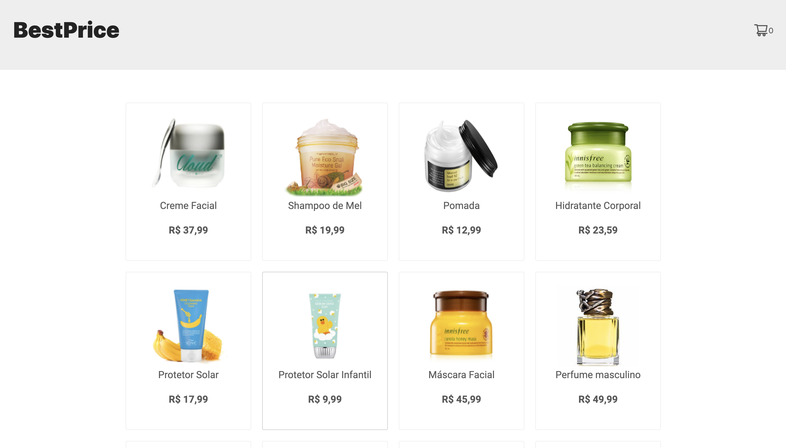
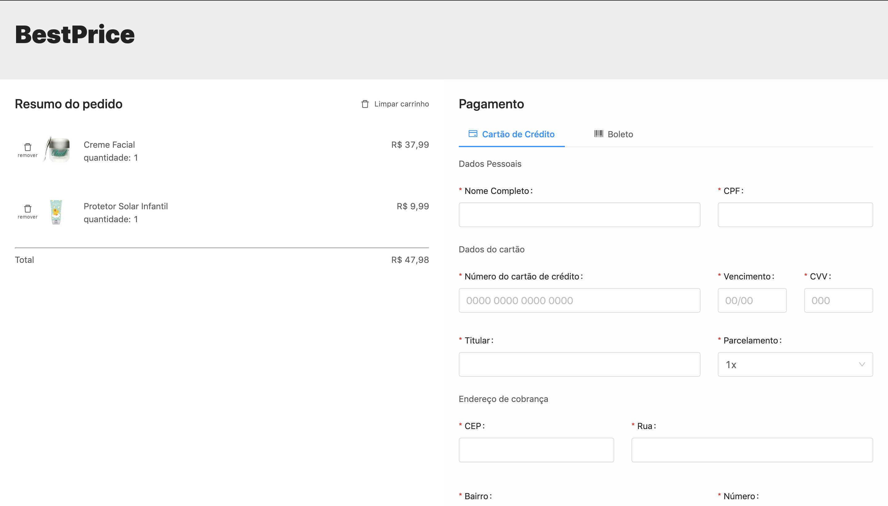

## BestPrice - mini ecommerce

BestPrice é a simulaçao de uma loja virtual onde é possível simular a compra de produtos e fazer o pagamento utilizando cartāo de crédito ou boleto. 
A aplicaçāo está conectada a api da pagarme para simular os pagamentos.

Desenvolvido utilizando React e outras bibliotecas como Redux e AntDesign.

### Instalaçāo

1. Faça o clone do repositório: [git@github.com:viniciusreiss/bestprice-ecommerce.git](https://git@github.com:viniciusreiss/bestprice-ecommerce.git)
2. Acesse a pasta: cd bestprice-ecommerce
3. Instale as depedências: `yarn install` ou `npm install`
4. Rodando o projeto: `yarn start` ou `npm start`
5. Abra: [http://localhost:3000](http://localhost:3000).

### Screenshots

